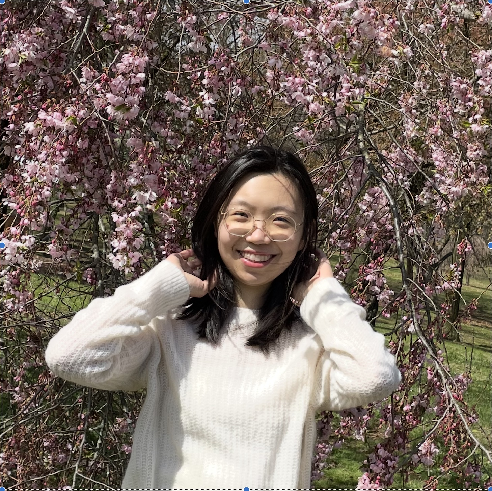

# About Me

  

Hi! I am Yuchen Zhang, a researcher/engineer interested in Statistics, Natural Language Processing, and Machine 
Learning with a deep understanding of the algorithm theories. I am also passionate about detecting algorithm 
bias and developing models that are fair. I care deeply about science for social good and believe that our 
research in technology and algorithms should benefit the public in a safe and fair way. 

Currently, I am a Software Engineer (Machine Learning)/Research Engineer at [Meta FAIR then GenAI], working on 
Trust and Safety.

See more about my publications, education, and professional experience [here](https://zycalice.github.io/yuchen-zhang/experience/).